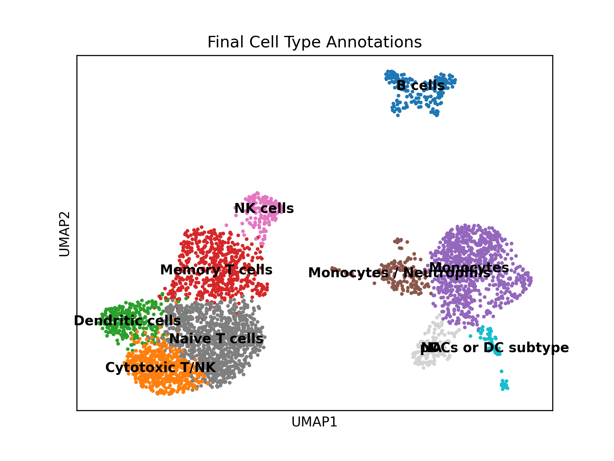
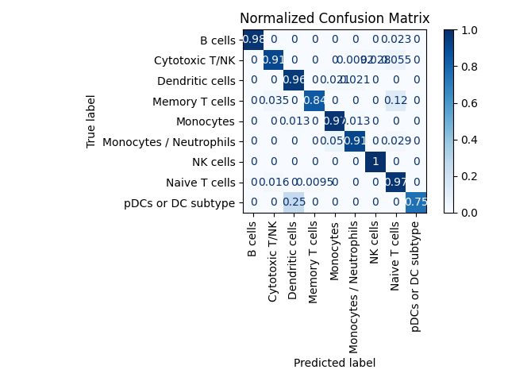

# ML-Based Immune Cell Classification from Multiome PBMC Data

##  Overview

This project combines **single-cell transcriptomics (scRNA-seq)** and **chromatin accessibility (scATAC-seq)** to predict immune cell types using **machine learning**.

Using multiome PBMC data from 10x Genomics, I trained classifiers to distinguish T cells, B cells, monocytes, NK cells, and others — based on both gene expression and chromatin accessibility.

---

##  Objective

- Classify immune cell types from single-cell omics data using ML.
- Compare transcriptomic vs epigenomic features for prediction.
- Integrate scRNA and scATAC data to explore regulatory biology.

---

##  Dataset

- **Source**: [10x Genomics Multiome PBMC 10k Dataset](https://www.10xgenomics.com/datasets/10-k-human-pbm-cs-multiome-v-1-0-chromium-x-1-standard-2-0-0)
- **Data types**:
  - scRNA-seq (5' expression matrix)
  - scATAC-seq (peak accessibility)
- ~10,000 human PBMCs

---

## ️ Methods

### scRNA-seq
- Quality filtering: Filtered cells with low UMI counts and retained high-quality cells (>1000 UMIs)
- Normalization, log transformation
- PCA, UMAP, Leiden clustering
- Cell type annotation using canonical markers to identify cell types such as Naive T cells, Cytotoxic T/NK, B cells, and Monocytes.

### scATAC-seq
- Processed scATAC-seq fragments by intersecting with known peaks (BED format)
- Constructed sparse cell × peak matrix using PyRanges
- Mapped peaks to nearby genes (±2 kb from TSS) using gene annotations (GTF)
- Summed ATAC signal across peaks linked to each gene to generate a gene activity matrix

### RNA & ATAC Integration
- Matched cells across RNA and ATAC modalities using shared cell barcodes.
- Aligned features (genes) between RNA and ATAC gene activity matrices.
- Scaled features and concatenated RNA + ATAC into a unified input matrix for modeling.

### Machine Learning
- Model: Trained XGBoost classifier
- Input features:
  - Top 1000 variable genes (scRNA)
  - Gene activity features derived from peak-gene mappin
- Output: Cell type label
- Evaluation: Accuracy, precision, recall, confusion matrix
- Misclassification: Inspected low-confidence or incorrect predictions

### Feature Importance & Interpretation
- Ranked RNA and ATAC features using XGBoost importance scores.
- Top RNA genes included:
    - PAX5, BANK1, MS4A1 (B cells)
    - LYZ, VCAN (Monocytes)
    - GNLY, GZMB, ZEB2 (Cytotoxic T/NK)
- Top ATAC features (gene activity) included:
    - KLRG1, IL2RB (T/NK cell function)
    - HCK, ARHGAP24 (Monocyte-related)
    - LINC02446 (potential regulatory non-coding RNA present in both RNA and ATAC).

## Step-by-Step Summary of Notebooks

### Step 1: 01_preprocessing_rna.ipynb - Load & Filter Raw scRNA-seq Data
- Loaded the raw .h5 file from 10x Genomics.
- Filtered out low-quality cells (UMIs > 1000).
- Randomly sampled 4000 high-quality cells.
Saved as filtered_rna_subset.h5ad

### Step 2: 02_rna_clustering_annotation.ipynb - Preprocess & Cluster scRNA-seq
- Normalized data, log-transformed, and found highly variable genes.
- Ran PCA, UMAP, and Leiden clustering.
- Identified top marker genes per cluster.
- Annotated clusters manually with known cell types (e.g. T cells, B cells).
Saved annotated RNA data as rna_annotated.h5ad
Plots saved to /results/plots

### Step 3: 03_build_atac_matrix.ipynb - Process scATAC-seq Data
- Loaded fragment and peak BED files.
- Intersected fragments with peaks using PyRanges.
- Created a sparse matrix of cells × peaks.
- Built atac_subset.h5ad storing chromatin accessibility.
Saved ATAC data as atac_subset.h5ad

### Step 4: 04_integration_gene_activity.ipynb - Link Peaks to Genes (ATAC → Gene Activity)
- Used GTF to define gene bodies ±2kb (TSS vicinity).
- Mapped peaks to nearby genes using PyRanges.
- Summed ATAC signals for each gene across its peaks.
- Created a new AnnData: gene activity matrix (cells × genes).
- Visulaize comparison of RNA vs Gene Activity
Saved as gene_activity.h5ad
Plots saved to /results/plots

### Step 5: 05_machine_learning.ipynb - Prepare ML Input
- Matched cells and genes in RNA and gene activity datasets.
- Scaled the data using StandardScaler.
- Concatenated RNA and ATAC features → [RNA | ATAC] for each gene.
- Extracted cell type labels from RNA metadata.
Saved final ML-ready data:
- X_combined.npy (features)
- y_labels.npy (cell types)

### Step 6: 06_ml_modeling.ipynb - ML Modeling
- Load X_combined and y_labels
- Train ML models (XGBoost first, then Logistic Regression, Random Forest, XGBoost)
- Evaluate performance (accuracy, confusion matrix)

### Step 7: 07_model_interpretation.ipynb – Model Interpretation & Biological Insights
- Loaded trained XGBoost model and label encoder.
- Used feature_importances_ to rank RNA and ATAC features.
- Separated and visualized the top 20 RNA and ATAC features.
- Projected ML predictions and confidence scores onto UMAP.
- Generated a confusion matrix using ground-truth annotations.
- Identified and saved misclassified cells for further inspection.
Saved outputs:
- top_rna_genes.csv, top_atac_genes.csv (Top features)
- umap_predictions.png 
- misclassifications.csv (Misclassified cells)
- confusion_matrix.png

---

##  Results
- Multimodal classifier (RNA + ATAC gene activity) using XGBoost achieved ~92% accuracy in predicting annotated cell types from scRNA-seq.
- Top RNA genes included:
    - ZEB2, PAX5, BANK1, MS4A1 (B cells)
    - LYZ, VCAN, CDKN1C (Monocytes)
    - GNLY, GZMB, ZEB2 (Cytotoxic T/NK)
- Top ATAC features (gene activity) included:
    - KLRG1, IL2RB (T/NK cell function)
    - HCK, ARHGAP24 (Monocyte-related)
    - LINC02446 (potential regulatory non-coding RNA present in both RNA and ATAC).
- Confusion matrix showed high agreement between true and predicted labels across most immune cell types, with a few misclassifications likely reflecting:
    - Transitional or ambiguous states (e.g., T/NK overlap)
    - Cells with low-confidence scores or weaker chromatin signals
- Prediction confidence scores were generally high (median >0.9), indicating strong classifier certainty.
- Misclassified cells were a minority and are candidates for further biological inspection 

  



## How to Run
```bash
git clone https://github.com/yourusername/Multiome-ML-Project-scRNA-scATAC.git
cd Multiome-ML-Project-scRNA-scATAC
pip install -r requirements.txt
jupyter notebook notebooks/rna_analysis.ipynb
```

## Future Work
- Use multi-modal deep learning (e.g., autoencoders)
- Extend to disease PBMCs (e.g., COVID, leukemia)
- Compare integration methods (WNN, Seurat v5, MuData)

## Acknowledgements
- Data from 10x Genomics
- Tools: Scanpy, scikit-learn, matplotlib, seaborn, Signac


